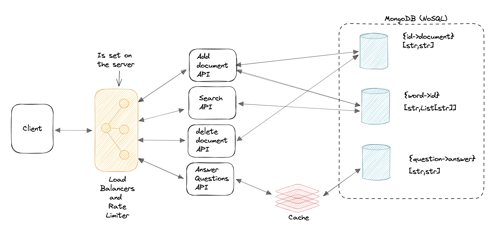

## Document Search System

**Optimal Search System for finding all documents containing search term**


Tools:

1. Task-Queue distributed saving of documents using celery
2. Request caching using redis
3. NoSQL for optimal querying of database (MongoDB)
4. Class-Based design
5. Backend Language: Python
6. Frontend Language: Vanilla JS

To run:

1. Clone the repo

```
git clone https://github.com/Xceptions/DocumentSearchEngine.git
```

2. Start the app

```
python3 app.py
```
